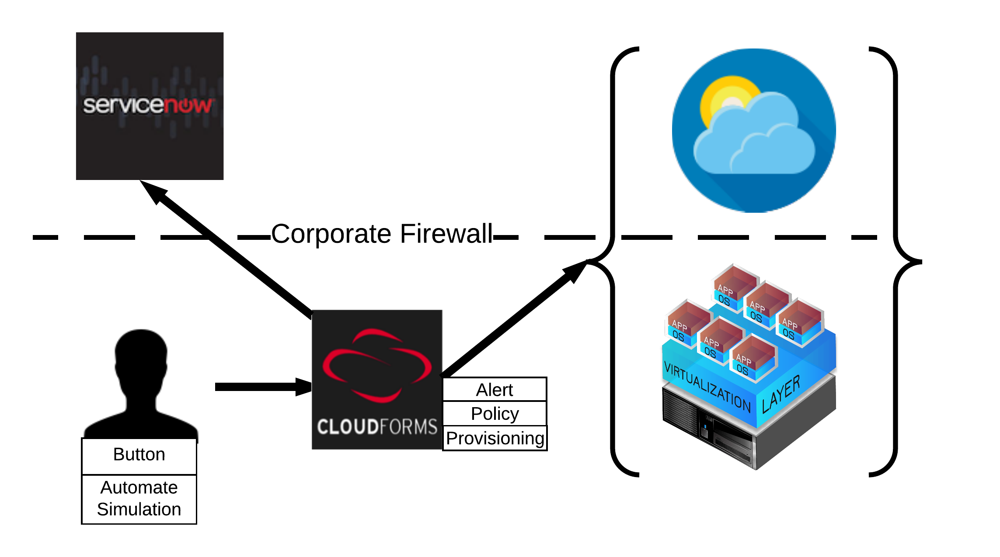
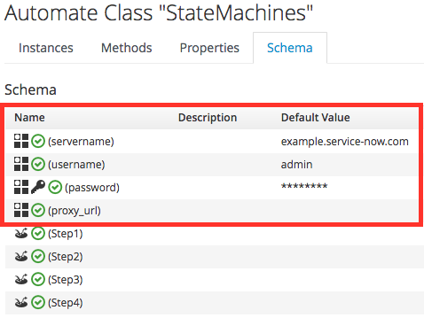

////
 README.adoc
-------------------------------------------------------------------------------
   Copyright 2016 Kevin Morey <kevin@redhat.com>

   Licensed under the Apache License, Version 2.0 (the "License");
   you may not use this file except in compliance with the License.
   You may obtain a copy of the License at

       http://www.apache.org/licenses/LICENSE-2.0

   Unless required by applicable law or agreed to in writing, software
   distributed under the License is distributed on an "AS IS" BASIS,
   WITHOUT WARRANTIES OR CONDITIONS OF ANY KIND, either express or implied.
   See the License for the specific language governing permissions and
   limitations under the License.
-------------------------------------------------------------------------------
////

= CloudForms ServiceNow_CMDB

The purpose of this project is to provide a starting point for integrating Red Hat (R) https://www.redhat.com/en/technologies/cloud-computing/cloudforms[Red Hat CloudForms] and ServiceNow's CMDB management.

== Table of Contents

* <<Overview>>
* <<Installation Steps>>
** <<Clone the Repo>>
** <<Import the Automate Domain>>
** <<Import the Custom Buttons>>
** <<Update Automate StateMachine>>
* link:documentation/userguide.adoc[User Guide]
* link:documentation/troubleshooting.adoc[Troubleshooting Guide]
* <<Contribute>>

== Overview

== Installation Steps

IMPORTANT: You MUST have the link:https://github.com/rhtconsulting/cfme-rhconsulting-scripts.git[Consulting Rake Scripts] installed on your CloudForms appliance first!

=== Clone the Repo

 cd /root
 git clone https://github.com/ramrexx/ServiceNow_CMDB.git

=== Import the Automate Domain

 /usr/bin/miqimport domain ServiceNow_CMDB /root/ServiceNow_CMDB/automate/

=== Import the Custom Buttons

 /usr/bin/miqimport buttons /root/ServiceNow_CMDB/buttons/ServiceNow_CMDB_Vm_.yaml

=== Update Automate StateMachine

* Log into your CloudForms/ManageIQ UI.
* Navigate to Automate / ServiceNow_CMDB / Integration / ServiceNow / CMDB / StateMachines
** Update the *StateMachine* class schema with your ServiceNow instance information (i.e. dev?????.service-now.com) and credentials.
** Add proxy_url if necessary.

<<top>>

== Contribute

Have an idea and want to help? Fork the repo and link:https://github.com/ramrexx/ServiceNow_CMDB/pulls[Submit a pull request]

<<top>>
