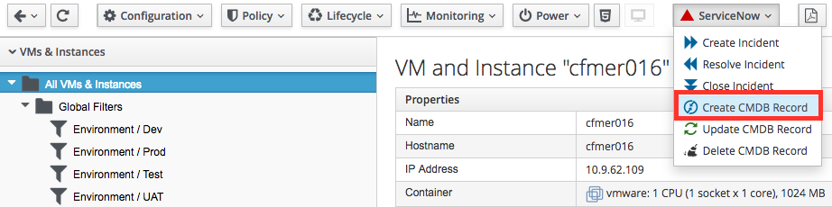
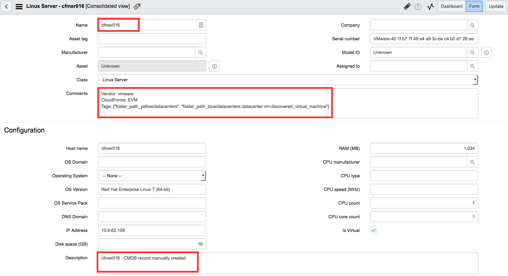
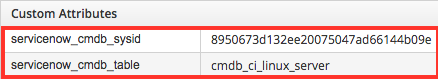
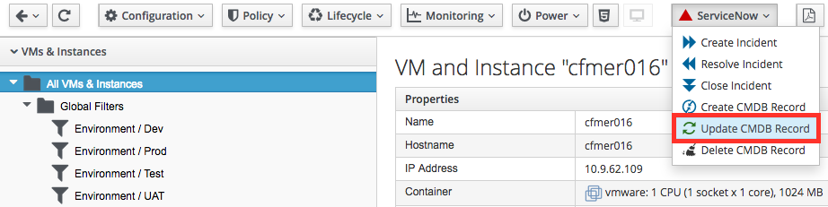
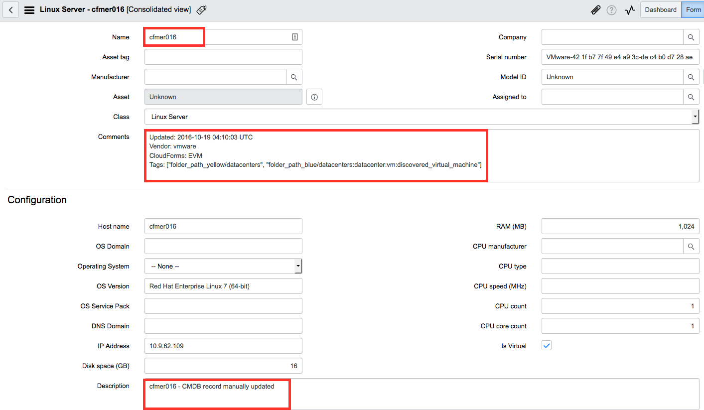
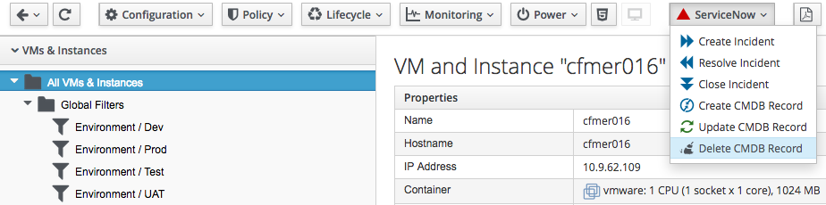

////
 userguide.adoc

-------------------------------------------------------------------------------
   Copyright 2016 Kevin Morey <kevin@redhat.com>

   Licensed under the Apache License, Version 2.0 (the "License");
   you may not use this file except in compliance with the License.
   You may obtain a copy of the License at

       http://www.apache.org/licenses/LICENSE-2.0

   Unless required by applicable law or agreed to in writing, software
   distributed under the License is distributed on an "AS IS" BASIS,
   WITHOUT WARRANTIES OR CONDITIONS OF ANY KIND, either express or implied.
   See the License for the specific language governing permissions and
   limitations under the License.
-------------------------------------------------------------------------------
////

= ServiceNow_CMDB User Guide
This user guide will walk you through various integrations with ServiceNow CMDB management.

== Table of Contents
* <<Create CMDB Record via Custom Button>>
* <<Update CMDB Record via Custom Button>>
* <<Delete CMDB Record via Custom Button>>
* link:troubleshooting.adoc[Troubleshooting Guide]

=== Create CMDB Record via Custom Button
Steps to create a CMDB record:

* Log into your CloudForms/ManageIQ UI.
* Navigate to a VM.
* Under the *ServiceNow* button group select *Create CMDB Record*.

* Navigate to your ServiceNow instance and look at *Servers*. You should see details of your CMDB record under *All Servers*. Take note the *Number*, *Comments* and other information populated by CloudForms.

* Navigate back to your CloudForms VM. At the bottom of the summary page you should see *Custom Attributes* containing ServiceNow CMDB attributes.

<<top>>

=== Update CMDB Record via Custom Button
Steps to update a CMDB Record:

* Log into your CloudForms/ManageIQ UI.
* Navigate to a VM where you have previously created the CMDB.
* Under the *ServiceNow* button group select *Update CMDB Record*.

* Log into your ServiceNow instance and look at *Servers*. You should see details of your CMDB record under *All Servers*. Note the *Comments* have been updated!

<<top>>

=== Delete CMDB Record via Custom Button
Steps to delete a CMDB Record:

* Log into your CloudForms/ManageIQ UI.
* Navigate to a VM where you have previously created the CMDB.
* Under the *ServiceNow* button group select *Delete CMDB Record*.

* Log into your ServiceNow instance and look at *Servers*.
* Your CMDB record should have removed.
* Navigate back to your CloudForms VM. At the bottom of the summary page you should see *Custom Attributes* containing ServiceNow CMDB attributes are gone.

<<top>>
